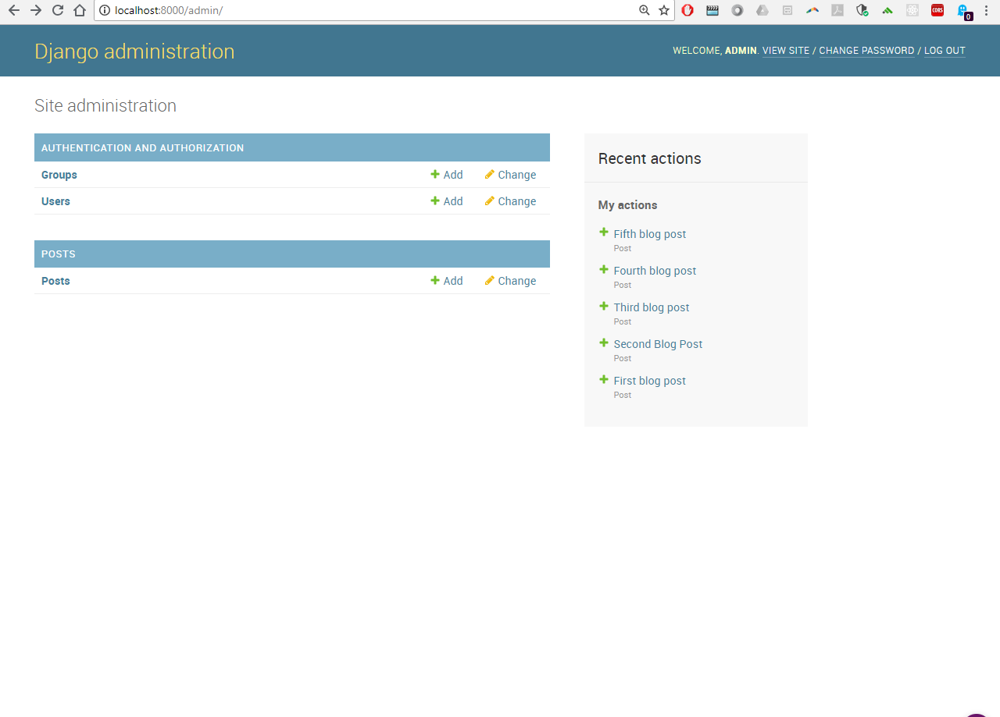
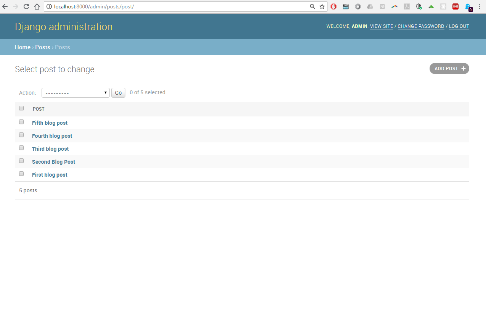
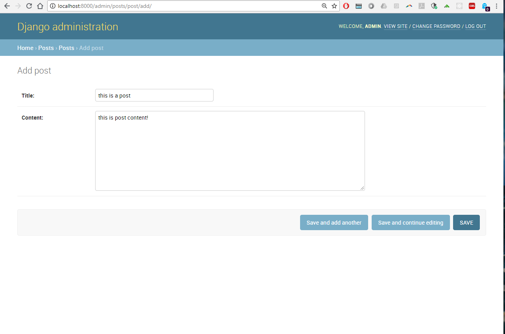
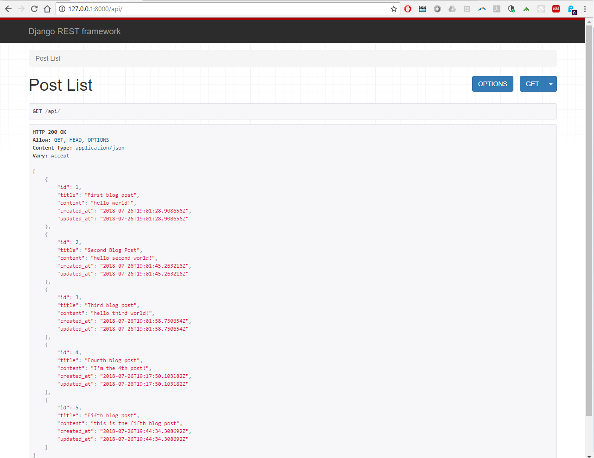
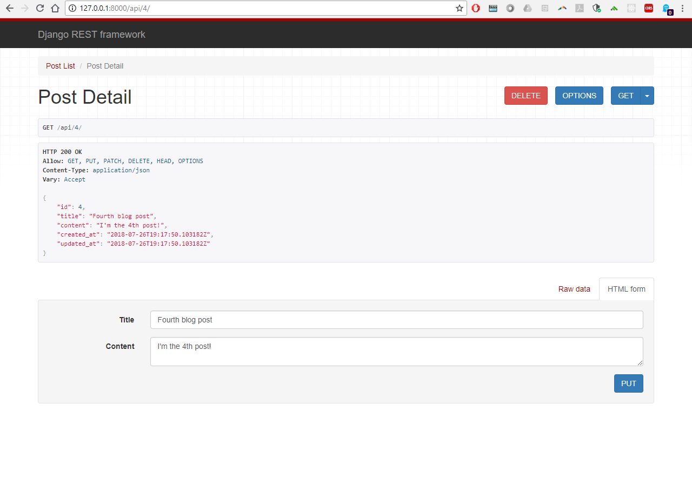

# Django REST API -- Create Read Update Delete 

`activate/deactivate env` 

`python manage.py runserver `

### log in to admin -- http://localhost:8000/admin/

### posts home -- http://localhost:8000/admin/posts/post/

### to make a POST -- http://localhost:8000/admin/posts/

### to view all POSTS -- http://127.0.0.1:8000/api/ 

### to view a specific post based on ID  -- http://127.0.0.1:8000/api/4/ 

